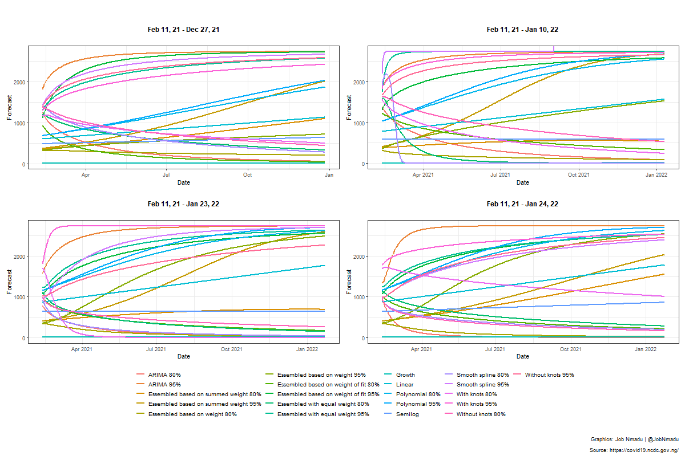

```{r setup, include=FALSE}
knitr::opts_chunk$set(echo = TRUE)
```

# Introduction

The advent of the COVID-19 pandemic really put everyone in confusion and as the days, weeks went-by, everyone was trying to understand the trend and the direction of the incidence. While the medicals were in their labs trying to understand the anatomy of the various, various statisticians and data scientists were trying to model the trend so as to guide future actions and preparations. One of the early models was done for Australia by [@Rami2020]. After observing the beatifuly animations of the incidence of the virus in the various regions of Australia, the motivation to do so was kindled. However, the first setback was the format the Nigerian Centre for Disease Control (NCDC) [@NCDC2020] was publishing the incidence in Nigeria was not very #RStats [@rstat2020] friendly. There were two main issues:

1. The data was and has been hard-formatted using the comma thousand separator which was and has remain difficult to easily analysed so alternative means of removing the format had to be worked out.

2. The data supplied by NCDC to the main collation centre of the COVID-19 at the Johns Hopkins University Center for Systems Science and Engineering (JHU-CCSE) [@ccse2020] was not disaggregated by regions as in the case of Australia, therefore, the data had to be manualy compiled from the website (https://covid19.ncdc.gov.ng/) of the agency.

For the above two reasons, the animation for Nigeria could not be achieved almost immediately. After the initial manual compilation of the data set from NCDC, an animation of the incidence in Nigeria was made on the 3rd of May, 2020 as shown below.


Thereafter, daily summaries, trend of the observed cases and possible future path through modeling and forecasting were made once the data is updated. The forecast lenght was usually the total length of the observed data which entually led to the concept of **equal length forecast**. It was in this wise that it was observed that the changes in forecast with just a additional day's data were quite alarming. Hence there was need to have a way of quickly comparing time-variant forecasts. After careful consideration, the concept was synthesized into the _Dyn4cast_ package [@nma2020]. Presently, the package has five functions.

* DynamicForecast

* constrainedforecast  

* linearsystems 

* MLMetrics  

* MallowsCP  

* Percent

* quicksummary

* scaledlogit

* invscaledlogit

The package is currently available in GitHub and can be installed as follows:

`devtools::install_github("JobNmadu/Dyn4cast")`.

In this blog, the capabilities of the `DynamicForecast` function is explored.

# Load the library and format the data

The sample data is the daily COVID-19 cases recorded and aggregagted into national data. The break points used for the splines modelling were established via visual examination of the observed data. The data cover the period `2020-02-29` to `2021-02-10`.

```{r example, eval = TRUE, warning = FALSE, message = FALSE}

library(Dyn4cast)
data <- COVID19
data$Date <- as.Date(data$Date, format = '%m/%d/%Y')
Dss <- seq(data$Date[1], by = "day", length.out = length(data$Case))
lastdayfo21 <- Dss[length(Dss)]

BREAKS = c(70, 131, 173, 228, 274)
```

# Modelling and forecast for the full data range

The constrained and unconstrained forecast are presented for compaison but the right one is the constrained forecast. It was necessary to consraine the forecast to the positive quadrant since ther is no zero and negative observations.

```{r eval = TRUE, warning = FALSE, message=FALSE}
Days_full <- DynamicForecast(Data = data, BREAKS = BREAKS, MaximumDate = "2021-02-10", Trend = "Day", Length = 0, Type = "Integer")
summary(Days_full$`Ensembled based on summed weight`)
```


```{r eval = TRUE, warning = FALSE, message=FALSE}
knitr::kable(as.data.frame(Days_full$`Unconstrained Forecast`),
             row.names = FALSE, "html")
```


```{r eval = TRUE, warning = FALSE, message=FALSE}
knitr::kable(as.data.frame(Days_full$`Constrained Forecast`),
             row.names = FALSE, "html")
```


```{r eval = TRUE, warning = FALSE, message=FALSE}
knitr::kable(as.data.frame(Days_full$RMSE), row.names = FALSE, "html")
```


```{r eval = TRUE, warning = FALSE, message=FALSE}
Days_full$`Unconstrained forecast Plot`
```


```{r eval = TRUE, warning = FALSE, message=FALSE}
Days_full$`Constrained forecast Plot`
```

# Modelling and forecast by using data as at 28 days earlier

```{r eval = TRUE, warning = FALSE}
KK_28 <- data[data$Date <= lastdayfo21 - 28, ]
Days_28 <- DynamicForecast(Data = KK_28, BREAKS = BREAKS, MaximumDate = "2021-02-10", Trend = "Day", Length = 0, Type = "Integer")
summary(Days_28$`Ensembled based on summed weight`)

knitr::kable(as.data.frame(Days_28$`Unconstrained Forecast`),
             row.names = FALSE, "html")
knitr::kable(as.data.frame(Days_28$`Constrained Forecast`),
             row.names = FALSE, "html")
knitr::kable(as.data.frame(Days_28$RMSE), row.names = FALSE, "html")
Days_28$`Unconstrained forecast Plot`
Days_28$`Constrained forecast Plot`
```

# Modelling and forecast by using data as at 14 days earlier

```{r eval = TRUE, warning = FALSE}
KK_14 <- data[data$Date <= lastdayfo21 - 14, ]
Days_14 <- DynamicForecast(Data = KK_14, BREAKS = BREAKS, MaximumDate = "2021-02-10", Trend = "Day", Length = 0, Type = "Integer")

summary(Days_14$`Ensembled based on weight`)

knitr::kable(as.data.frame(Days_14$`Unconstrained Forecast`),
             row.names = FALSE, "html")
knitr::kable(as.data.frame(Days_14$`Constrained Forecast`),
             row.names = FALSE, "html")
knitr::kable(as.data.frame(Days_14$RMSE), row.names = FALSE, "html")
Days_14$`Unconstrained forecast Plot`
Days_14$`Constrained forecast Plot`
```

# Modelling and forecast by using data as at 1 day earlier

```{r eval = TRUE, warning = FALSE}
KK_1 <- data[data$Date <= lastdayfo21 - 1, ]
Days_1 <- DynamicForecast(Data = KK_1, BREAKS = BREAKS, MaximumDate = "2021-02-10", Trend = "Day", Length = 0, Type = "Integer")

summary(Days_1$`Ensembled based on weight`)

knitr::kable(as.data.frame(Days_1$`Unconstrained Forecast`),
             row.names = FALSE, "html")
knitr::kable(as.data.frame(Days_1$`Constrained Forecast`),
             row.names = FALSE, "html")
knitr::kable(as.data.frame(Days_1$RMSE), row.names = FALSE, "html")
Days_1$`Unconstrained forecast Plot`
Days_1$`Constrained forecast Plot`
```

# Comparing the constrained forecast plots for the four-time periods

```{r eval = TRUE, warning = FALSE, echo=FALSE, dev='png'}

#png("numstatesFFf.png", width=1200, height=800)
library(patchwork)
Days_28$`Constrained forecast Plot` + Days_14$`Constrained forecast Plot` + Days_1$`Constrained forecast Plot` + Days_full$`Constrained forecast Plot` +  plot_annotation() +
plot_annotation(title = " ",
                  subtitle = " ",
                caption = "Graphics: Job Nmadu | @JobNmadu
  \n Source: https://covid19.ncdc.gov.ng/") +
  plot_layout(guides = "collect") &
  theme(plot.title = element_text(hjust = 0.5, size = 12, face = "bold"),
        plot.subtitle = element_text(hjust = 0.5, size = 12),
        plot.background = element_rect(),
        legend.position = "bottom",
        legend.title = element_blank(),
        legend.text = element_text(size = 10))
invisible(dev.off())


```



# References

