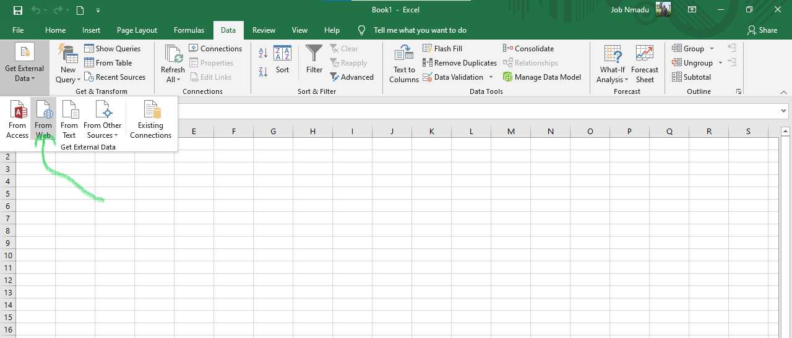

```{r setup, include=FALSE}
knitr::opts_chunk$set(echo = TRUE)
```

# Introduction

On the advent of COVID-19 globally and since February 29, 2020 in Nigeria, motivations to provide visuals of the trends and to provide guide to Nigerians on how to conduct themselves responsibly was boosted by the publication of the first coronavirus package and the awesome animation of the province level by Krispin and Byrnes 2020. That immediately sent me working on how to animate the cases for Nigeria. However, this desire was met with short comings because the data publish at the Johns Hopkins University Center for Systems Science and Engineering (JHU-CCSE) by the Nigerian Centre for Disease Control is agrregated nationally, whereas the animations that motivated me were regional for Australia. In addition, the daily updates only provide the regional details of the confirmed cases. The casualties, recoveries and active cases are provided in a single Table which aggregates all the previous cases as well as the current data, rather than provide the daily as they occur daily. So daily casualties, recoveries, deaths abd active cases were not reported separately.

Faced wiith this challenges, immediately sustainable solutions had to be found, which is scrapping data from the Table published in PDF. At the end of the day, four methods of scrapping the data were explored until I had to settle for one.

# Scrapping data from PDF Table

The first method was to scrap the data from the PDF Table. The codes for that is provided below.

```{r, message=FALSE}

library(pdftools)
library(tidyverse)
text <- 
  pdf_text("data/Nigeria_300820_36.pdf") %>%
  readr::read_lines()
# text    displaying the text, save the relevant lines where the data appears
Data <- text[64:101] # the lines containing the data
write_delim(as.data.frame(Data), "data/300820.csv", delim = " ") # saved to CSV

KK <- read_csv("data/300820.csv", 
                            skip = 1, skip_empty_rows = TRUE,
                            trim_ws = TRUE, col_names = FALSE) # loaded to memory for further use
head(KK)
```


However, it was not efficient as the scrapped Table could not be separated into columns for further analysis.

# Srapping data from the website

The second is to scrap the data from the website as shown in the codes. 

```{r echo = TRUE, eval=FALSE}

library(rvest)

url <- "https://covid19.ncdc.gov.ng/report/"

COVID19 <- url %>%
  read_html() %>%
  html_nodes(xpath='//*[@id="custom1"]') %>%
  html_table()

COVID19 <- COVID19[[1]] # the Table is item 1 in the scrapped data

xlsx::write.xlsx2(COVID19, file = "data/daily160920.xlsx", 
                  col.names = TRUE, row.names = FALSE) # the scrapped data is saved to Excel file

```


```{r echo=FALSE, message=FALSE, warning=FALSE}

head(readxl::read_xlsx("data/daily161220.xlsx"))

```


The outcome of this method is better than that of the PDF but the thousand values were comma-separated, so, to use the data further, the commas had to be removed by formatting manually.

# Srapping data from Excel

The third method is to use Excel to scrap the data. For this, open `MS-Excel`, Select `Data` from the _Menu_ as shown in the graphics below

```{r echo=FALSE, out.width='100%'}



```

```{r echo=FALSE, out.width='100%'}

knitr::include_graphics("img/page2.png")

```

```{r echo=FALSE, out.width='100%', eval=FALSE}

knitr::include_graphics("img/page3.png")

```
This proved more helpful that the first two and is easier to use as it does not require any coding as shown in the pictures.

# Scraping data by copy-paste to from website to Excel

The fourth method is to scrap the data directly by selecting and copying the data from the website.

```{r echo=FALSE, out.width='100%'}

img <- png::readPNG("img/page4.png")
grid::rasterGrob(img, interpolate=TRUE)

```

This is the easiest and most efficient as no codes are needed and the copied data is saved directly in Excel for further formatting.

After scrapping the data with any of the methods mentioned above, then, they are formatted for preparing visuals. To study the trend of spread and how recoveries and/or deaths occur from time to time, the daily records were obtained from the aggregated data.
